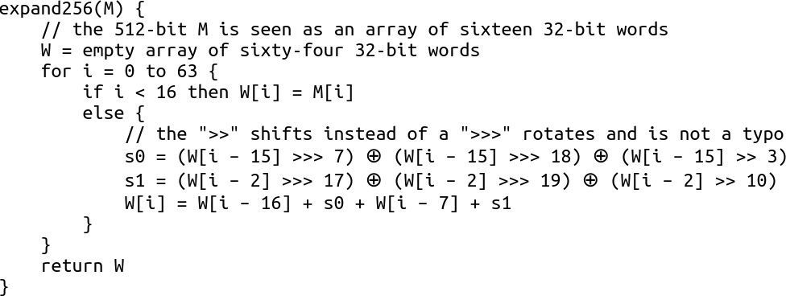
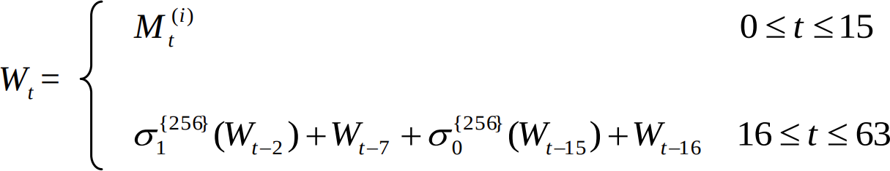
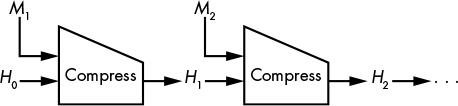
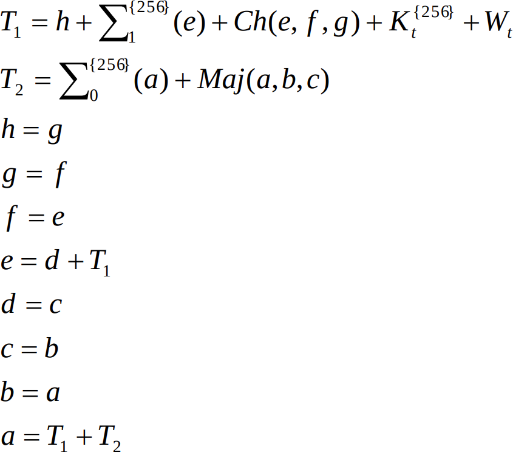

# The SHA-256 Project

> This project was originally assigned in NYU Tandon's CS-GY 6903 Applied
Cryptography course, Fall 2021. Here's the [original course
repo](https://github.com/oconnor663/applied_crypto_2021_fall) with all the
other problem sets.

In this project we're going to implement SHA-256 ourselves, and then we'll use
our implementation to demonstrate a "length extension attack". To get a sense
of scale, take a look at the [SHA-256 pseudocode on
Wikipedia](https://en.wikipedia.org/wiki/SHA-2#Pseudocode). That pseudocode
will be one of our references, and there will be several direct quotes from it
below. The [animations in this video](https://youtu.be/f9EbD6iY9zI) might also
help you get a big-picture sense of what the algorithm is doing.

Implementing that pseudocode takes less than a hundred lines of Python, which
might not seem like a lot. But there are lots of little details in those lines,
and the nature of the "avalanche effect" is such that a tiny mistake will
totally mess up your output, usually without giving you any useful feedback
about what you did wrong. So we'll move slowly, piece by piece, making sure to
test each piece before we move on to the next. Read and reread each problem
carefully, *two or three times through,* and then follow the instructions
*exactly* as you write your code. If the instructions are unclear, ask for help
and avoid the temptation to guess. Mistakes will be difficult to debug, which
makes this project challenging.

So...what's the point of such a challenging project? If we almost never
implement hash functions ourselves in the real world, why are we going to spend
our precious time on it now? Two reasons:

Concretely, as long as SHA-2 remains widely used, length extension attacks will
remain a common pitfall. You need to know about them to use SHA-2 safely, and
to help others use it safely. As with most attacks, the best way to understand
the length extension attack is to do it yourself, which means we need to get
our hands on the inner workings of SHA-2.

More broadly, there are just so many black boxes in cryptography that we almost
never look inside, especially our block ciphers, stream ciphers, and hash
functions. No one has enough time to learn the details of all of them, not even
professional cryptographers. But these algorithms are not magic, and this class
would be doing you a disservice if we never opened up any black boxes. Our goal
isn't to memorize all the details, but to build up the sort of practical
intuition that can only come from having seen the details before. And I want
you to come away from this class with the confidence that you can handle this
level of detail for any algorithm, if and when you need to.

So this is it. This is where we're going to open one of the black boxes and get
all the way to the bottom of it. This is SHA-256.

## Contents

* [Workflow](#workflow)
* [Example input](#example-input)
* [Example output](#example-output)
* [Building blocks](#building-blocks)
   * [Problem 1: addition modulo 2<sup>32</sup>](#problem-1-addition-modulo-232)
   * [Problem 2: bitwise right rotation](#problem-2-bitwise-right-rotation)
* [The Message Schedule](#the-message-schedule)
   * [Problem 3: `little_sigma0()`](#problem-3-little_sigma0)
   * [Problem 4: `little_sigma1()`](#problem-4-little_sigma1)
   * [Problem 5: the message schedule](#problem-5-the-message-schedule)
* [The Round Function](#the-round-function)
   * [Problem 6: `big_sigma0()`](#problem-6-big_sigma0)
   * [Problem 7: `big_sigma1()`](#problem-7-big_sigma1)
   * [Problem 8: `choice()`](#problem-8-choice)
   * [Problem 9: `majority()`](#problem-9-majority)
   * [Problem 10: the round function](#problem-10-the-round-function)
* [The Compression Function](#the-compression-function)
   * [Problem 11: the compression function](#problem-11-the-compression-function)
* [Padding](#padding)
   * [Problem 12: padding](#problem-12-padding)
* [The Hash Function](#the-hash-function)
   * [Problem 13: the hash function](#problem-13-the-hash-function)
* [The Length Extension Attack](#the-length-extension-attack)
   * [Problem 14: modeling the extended input](#problem-14-modeling-the-extended-input)
   * [Problem 15: recovering the state](#problem-15-recovering-the-state)
   * [Problem 16: the length extension attack](#problem-16-the-length-extension-attack)
* [Conclusion](#conclusion)

## Workflow

This project was originally assigned in NYU Tandon's CS-GY 6903 Applied
Cryptography course. It's intended to be JSON-in-JSON-out and autograded. A
grading script is provided in this repo, but if you prefer you can also just
visually compare the output of your solution to the example output provided.

The arguments to the [`grade.py`](grade.py) script are the command to run your
solution. Internally, the grading script generates test input with
[`generate_input.py`](generate_input.py) and uses the Python solution provided
in [`solution_py/`](solution_py) to generate expected answers. So for example,
to test the provided Rust solution against the provided Python solution, you
would run this command:

```
./grade.py cargo run --manifest-path solution_rs/Cargo.toml
```

Or similarly, to test the Python solution against itself, you could run:

```
./grade.py solution_py/solution.py
```

## Example input

```json
{
  "problem1": [
    [1, 2],
    [4294967295, 1],
    [3050487260, 3710144918]
  ],
  "problem2": [
    [2, 1],
    [1, 1],
    [2919882184, 31]
  ],
  "problem3": 1114723206,
  "problem4": 1232674167,
  "problem5": "iguana wombat dog kangaroo llama turkey yak unicorn sheep xenoce",
  "problem6": 3536071395,
  "problem7": 651015076,
  "problem8": [2749825547, 776049372, 1213590135],
  "problem9": [3758166654, 2821345890, 1850678816],
  "problem10": {
    "state": [
        2739944672, 3126690193, 4191866847, 1163785745,
        3714074692, 1172792371, 283469062, 826169706
    ],
    "round_constant": 961987163,
    "schedule_word": 3221900128
  },
  "problem11": {
    "state": [
      2918946378, 1679978889, 1678006433, 650957219,
      379281712, 2112907926, 1775216060, 2152648190
    ],
    "block": "manatee fox unicorn octopus dog fox fox llama vulture jaguar xen"
  },
  "problem12": [0, 1, 55, 56, 64, 492022654431536432],
  "problem13": [
    "",
    "hello world",
    "aardvark zebra yak pig jaguar aardvark rhinoceros butte",
    "narwhal dog llama llama giraffe narwhal octopus dog xeno",
    "John Jacob Jingleheimer Schmidt! His name is my name too. Whenever we go out the people always shout there goes John Jacob Jingleheimer Schmidt! Nanananananana..."
  ],
  "problem14": {
    "original_input": "fox elephant dog",
    "chosen_suffix": "pig jaguar iguana"
  },
  "problem15": "bacb15aef84802baa0f530845013a98ee1eede664b914f8ebc2a520e69049a09",
  "problem16": {
    "original_hash": "27b82abe296f3ecd5174b6e6168ea683cd8ef94306d9abd9f81807f2fa587d2a",
    "original_len": 41,
    "chosen_suffix": "manatee jaguar zebra zebra dog"
  }
}
```

## Example output

```json
{
  "problem1": [3, 0, 2465664882],
  "problem2": [1, 2147483648, 1544797073],
  "problem3": 1345017931,
  "problem4": 2902922196,
  "problem5": [
    1768387937, 1851859063, 1869439585, 1948279919, 1730177889, 1852268914, 1869553772, 1818324321,
    544503154, 1801812256, 2036427552, 1970170211, 1869770272, 1936221541, 1881176165, 1852793701,
    3002878561, 3711121932, 1520676164, 3002441970, 2935068969, 1610329529, 1904580351, 3219988740,
    2337695268, 263015313, 2120931855, 131203777, 3818546915, 19163115, 3479924161, 2154860703,
    1790169326, 516580487, 2414737634, 909025701, 2241053595, 1237268359, 3797503938, 1773623028,
    2840671725, 2299292186, 1933596460, 2279513616, 514132674, 3245155609, 1753922983, 2241450350,
    2449659630, 262239956, 773552098, 3253131632, 3863807927, 879696536, 3143654396, 3973063648,
    509015903, 270850193, 1893431553, 719566283, 2310657204, 365781698, 3761063438, 1007484868
  ],
  "problem6": 3003388882,
  "problem7": 2194029931,
  "problem8": 1783753340,
  "problem9": 3893039714,
  "problem10": [
    1724514418, 2739944672, 3126690193, 4191866847,
    1638715774, 3714074692, 1172792371, 283469062
  ],
  "problem11": [
    1251501988, 1663226031, 2877128394, 4050467288,
    2375501075, 1434687977, 2625842981, 650253644
  ],
  "problem12": [
    "80000000000000000000000000000000000000000000000000000000000000000000000000000000000000000000000000000000000000000000000000000000",
    "800000000000000000000000000000000000000000000000000000000000000000000000000000000000000000000000000000000000000000000000000008",
    "8000000000000001b8",
    "8000000000000000000000000000000000000000000000000000000000000000000000000000000000000000000000000000000000000000000000000000000000000000000001c0",
    "80000000000000000000000000000000000000000000000000000000000000000000000000000000000000000000000000000000000000000000000000000200",
    "800000000000000036a01ffa96b12980"
  ],
  "problem13": [
    "e3b0c44298fc1c149afbf4c8996fb92427ae41e4649b934ca495991b7852b855",
    "b94d27b9934d3e08a52e52d7da7dabfac484efe37a5380ee9088f7ace2efcde9",
    "4b45e1bec21185865d1628a8a502eed789193a3c253a529983e4bc17fa65f32b",
    "99069f1eba4c874aba649c17136a253e1dd504cda936ab77cf189c2cf9eb88ff",
    "68b74d91364475247c10bfee2621eaa13bcabb033ed1dee58b74c05e7944489a"
  ],
  "problem14": "666f7820656c657068616e7420646f67800000000000000000000000000000000000000000000000000000000000000000000000000000000000000000000080706967206a616775617220696775616e61",
  "problem15": [
    3133871534, 4165468858, 2700423300, 1343465870,
    3790528102, 1267814286, 3156890126, 1761909257
  ],
  "problem16": "50417b93404facb1b481990a7bf6ac963b1e1ee0ccced8b2a5938caa28b52b41"
}
```

## Building blocks

We'll start with the smallest details at the very bottom of the box. As a first
step, we need to build a couple of math operations that Python doesn't give us
directly: modular addition and bitwise right-rotation.

### Problem 1: addition modulo 2<sup>32</sup>

If you've learned a language like C or Java before, you might know that modular
addition is what many languages do with integers by default. In these
languages, integers have some fixed size, like 32 bits, and any math operation
that would normally give a result ≥2<sup>32</sup> instead "overflows" and
starts counting up from 0 again. These fixed-size integer operations are very
efficient in hardware, so they're common in CPU instruction sets and in
algorithms like SHA-256. However, integers in Python have no fixed size, and
math operations in Python never overflow. If you want to see this in action,
ask Python for the value of 2<sup>1,000,000</sup>. This property is lovely for
our intuition as programmers, because it means Python integers work like the
regular math we're used to. But alas, it's not how addition is done in SHA-256,
so we'll need to give ourselves a helper function for this.

Define a function like `add32(x, y)`. (I'll suggest names for your functions
throughout this project, but you can name them whatever you like.) It should
add its two arguments and then take the result modulo 2<sup>32</sup>, i.e. the
remainder when the result is divided by 2<sup>32</sup>. Remember that `%` is
the "modulo" or "remainder" operator in Python, and `**` is the exponentiation
operator.

**Input:** a list of `(x, y)` pairs

**Output:** a list of results from calling `add32` on each pair

### Problem 2: bitwise right rotation

The other building block we need is bitwise rotation. Most programming
languages including Python provide a very similar operation called bit
_shifting_, usually written `<<` (left shift) or `>>` (right shift). A bit
rotation is like bit shift, but instead of "falling off the end" of the number,
the bits rotate around to the other end. This is nice for cryptographic
functions that need to do a lot of mixing, because it moves bits around without
losing any information. For example, consider this 32-bit number:

```
00000000000000000000000000001111
```

If we right-*shift* that number by two places, we get:

```
00000000000000000000000000000011
```

But if we right-*rotate* that number by two places, we get:

```
11000000000000000000000000000011
```

Python doesn't have a built-in bit rotation operator, but we can accomplish the
same thing by combining the results of two shifts. If you enjoy bit twiddling
puzzles, figure out how to do this before reading further. If not, it's ok to
just copy the following function, but make sure you take a few moments to walk
through the example above and see how it does the right thing.

```python
def rightrotate32(x, n):
    assert x < 2 ** 32, "x is too large. Did you use + instead of add32 somewhere?"
    right_part = x >> n
    left_part = x << (32 - n)
    return add32(left_part, right_part)
```

**Input:** a list of `(x, n)` pairs

**Output:** a list of results from calling `rightrotate32` on each pair

Using these helper functions and Python's other built-in operations, we're
going to do a lot of math using 32-bit integers. As a shorthand, we'll refer to
these integers as "words". A "word" is just another way of saying "an integer
of the size that we prefer to / are able to work with". The size of a word
depends on context, but **in the context of SHA-256, a "word" means a 32-bit
unsigned integer.**

## The Message Schedule

With those two building blocks in place, we're ready to implement the first
major moving part of our hash function, the "message schedule". Here the
"message" means the hash function's input. In each round of its compression
function, SHA-256 mixes in one word from the message. (Make sure you read the
definition of a "word" above.) The "message schedule" defines exactly what
those words are and the order in which they're used.

A SHA-256 message block is 64 bytes long, and a word is 4 bytes long, so one
block contains exactly 16 words. SHA-256 has 64 rounds, and the first 16 of
those rounds use those 16 message words directly. The subsequent 48 rounds mix
different message words together using a formula. We're about to implement that
formula. First we need a couple more small helpers, which we'll call
`little_sigma0` and `little_sigma1`.

### Problem 3: `little_sigma0()`

Given a word `x`, we define `little_sigma0(x)` to be the value:

```python
rightrotate32(x, 7) ^ rightrotate32(x, 18) ^ (x >> 3)
```

Implement this function in Python. You can copy the line above if you like.

**Inputs:** an integer `x`

**Outputs:** the value `little_sigma0(x)`

Based on [this paper](https://arxiv.org/pdf/1402.1314.pdf), I'm pretty sure the
name "sigma" (Greek lowercase σ and uppercase Σ) refers to the "S-boxes" or
"substitution boxes" that we're familiar with from block ciphers. See p. 57 of
*Serious Cryptography*.

### Problem 4: `little_sigma1()`

Similarly, given a word `x`, we define `little_sigma1(x)` to be the value:

```python
rightrotate32(x, 17) ^ rightrotate32(x, 19) ^ (x >> 10)
```

Implement this function in Python too. Again, you can copy the line above if
you like.

**Inputs:** an integer `x`

**Outputs:** the value `little_sigma1(x)`

### Problem 5: the message schedule

Now we're ready to compute the full 64-**word** message schedule array, which
is usually called `W` (for "words"). As we said above, the block size of
SHA-256 is 64 **bytes**, so for this process you start off with a 64-byte block
of input. Convert these 64 bytes into 16 words, by converting each 4-byte group
into an integer using a **big-endian** conversion. (Using the wrong endianness
here will be a *common mistake*.) This gives you the first 16 elements of `W`.
For each of the remaining 48 elements — that is, for each index from 16 to 63 —
use the following formula:

```
W[i] := W[i-16] + little_sigma0(W[i-15]) + W[i-7] + little_sigma1(W[i-2])
```

Note that in this case the formula is pseudocode, not Python. The `:=` symbol
means "is defined to be", similar to `=` in Python. Importantly, the `+` symbol
in SHA-256 pseudocode does *not* mean Python's `+`, but rather the `add32()`
function that we defined back in Problem&nbsp;1. (Implementing pseudocode using
regular Python addition rather than `add32` will be a *common mistake*
throughout this project.) Depending on how you structure your Python code, you
might also want to use the
[`.append()`](https://docs.python.org/3/tutorial/datastructures.html) method on
lists.

Define a function like `message_schedule(block)` which takes a 64-byte block
and returns a 64-word list, according to the formula described above. Your
input for this problem is an ASCII string of length 64. Convert it to bytes,
and use your `message_schedule()` function to construct message schedule for
that block. Your output should be the resulting list.

**Input:** an ASCII string of length 64, which represents a block of input for the compression function

**Output:** the resulting message schedule, a list of 64 words (integers)

As you work on this part of the algorithm, it might be helpful or interesting
to compare notes with how different sources describe it. Here's how *Serious
Cryptography* describes it, on p. 119:

<kbd></kbd>

And here's how [the pseudocode on
Wikipedia](https://en.wikipedia.org/wiki/SHA-2#Pseudocode) describes it:

```
create a 64-entry message schedule array w[0..63] of 32-bit words
(The initial values in w[0..63] don't matter, so many implementations zero them here)
copy chunk into first 16 words w[0..15] of the message schedule array

Extend the first 16 words into the remaining 48 words w[16..63] of the message schedule array:
for i from 16 to 63
    s0 := (w[i-15] rightrotate  7) xor (w[i-15] rightrotate 18) xor (w[i-15] rightshift  3)
    s1 := (w[i- 2] rightrotate 17) xor (w[i- 2] rightrotate 19) xor (w[i- 2] rightshift 10)
    w[i] := w[i-16] + s0 + w[i-7] + s1
```

And finally, here's how it's described in the official standard that defines
SHA-256, p. 22 of [FIPS
180-4](https://nvlpubs.nist.gov/nistpubs/FIPS/NIST.FIPS.180-4.pdf):

<kbd></kbd>

These are all different ways of describing the same message schedule.

Once you've got the message schedule implemented correctly, you've reached the
first major milestone of the project. Well done! We'll need to set it aside for
a moment to focus on another big moving part, but don't worry: we'll come back
and make use of it before long.

## The Round Function

As we said above, the SHA-256 compression function does 64 rounds of mixing.
We're about to implement the operation that's done for each round. To get
started, we're going to need four more small helper functions:

### Problem 6: `big_sigma0()`

Given a word `x`, we define `big_sigma0(x)` to be the value:

```python
rightrotate32(x, 2) ^ rightrotate32(x, 13) ^ rightrotate32(x, 22)
```

Implement this function in Python. You can copy the line above if you like.

**Inputs:** an integer `x`

**Outputs:** the value `big_sigma0(x)`

### Problem 7: `big_sigma1()`

Given a word `x`, we define `big_sigma1(x)` to be the value:

```python
rightrotate32(x, 6) ^ rightrotate32(x, 11) ^ rightrotate32(x, 25)
```

Implement this function in Python too. Again, you can copy the line above if
you like.

**Inputs:** an integer `x`

**Outputs:** the value `big_sigma1(x)`

### Problem 8: `choice()`

Given three words, `x`, `y`, and `z`, we define `choice(x, y, z)` to be the value:

```python
(x & y) ^ (~x & z)
```

Implement this function in Python too. Again, you can copy the line above if
you like.

Note that the `~` symbol in Python means "bitwise-not", i.e. turn all the
0-bits into 1's and all the 1-bits into 0's. This isn't an operation we need
very often, but it's nice that it's built-in. The fact that Python integers are
both signed and also variably-sized means that the behavior of `~` is subtler
than it might seem at first glance. Because of the rules of ["two's complement"
signed arithmetic](https://en.wikipedia.org/wiki/Two%27s_complement), it tends
to give us negative numbers. Luckily, all the little details work out in the
end, and we can use `~` here without worrying about it. You can just trust me
on that and copy the line of code above, or you can explore how `~` works
in Python as an exercise.

**Inputs:** a list of three integers, `[x, y, z]`

**Outputs:** the value `choice(x, y, z)`

Before you move on from this function, take a moment to stare at it. Can you
tell why it's called "choice"?

### Problem 9: `majority()`

The last helper for the round function. Given three words, `x`, `y`, and `z`,
we define `majority(x, y, z)` to be the value:

```python
(x & y) ^ (x & z) ^ (y & z)
```

Implement this function in Python too. Again, you can copy the line above if
you like.

**Inputs:** a list of three integers, `[x, y, z]`

**Outputs:** the value `majority(x, y, z)`

Same follow-up question as above: Can you tell why this function is called
"majority"? This one's a little trickier. Three bits put together have
2<sup>3</sup> = 8 possible values, and the easiest way to see this one is to
just make a table and calculate what happens in each case.

### Problem 10: the round function

Alright, we're ready to implement the next big moving part of SHA-256, the
round function. The round function takes three arguments. The most important of
these is the **state**, a list of 8 words. Recall the diagram of the
Merkle–Damgård construction from p. 112 of *Serious Cryptography*:

<kbd></kbd>

The values H<sub>0</sub>, H<sub>1</sub>, and H<sub>2</sub> represent this
8-word state as it's transformed by each call to the compression function. At
this point we're working on the round function, which is _inside_ the
compression function (i.e. inside the trapezoids in that diagram), but it's the
same state that we're talking about.

The other two inputs to the round function are the **round constant** and the
**schedule word**, each of which is one word (an integer). As you might guess,
the schedule word is ultimately going to come from the message schedule, which
we implemented in Problem&nbsp;5, but for now we'll just take it as an
argument.

Define a function like `round(state, round_constant, schedule_word)`. This
function starts by computing several values, using the helper functions defined
above:

```
ch    := choice(state[4], state[5], state[6])
temp1 := state[7] + big_sigma1(state[4]) + ch + round_constant + schedule_word
maj   := majority(state[0], state[1], state[2])
temp2 := big_sigma0(state[0]) + maj
```

As in Problem&nbsp;5, these formulas are pseudocode, and the `+` symbol means
`add32()`. Finally, the round function assembles a new state:

```
new_state := [
    temp1 + temp2,
    state[0],
    state[1],
    state[2],
    state[3] + temp1,
    state[4],
    state[5],
    state[6],
]
```

This `new_state` is the return value of `round()`.

Your input for this problem is an object with three fields, `"state"`
containing a list of 8 integers, `"round_constant"` containing one integer, and
`"schedule_word"` containing one integer. Call your `round()` function with
these three arguments. Your output should be the resulting new state.

**Input:** an object with three fields, `"state"`, `"round_constant"`, and `"schedule_word"`

**Output:** a list of 8 words (integers), the new state returned by `round()`

As we did in Problem&nbsp;5, we can compare how different sources describe the
same part of the algorithm. *Serious Cryptography* doesn't include the SHA-256
round function in detail, describing it only as "more complex than that of
SHA-1" on p. 119.

[The pseudocode on Wikipedia](https://en.wikipedia.org/wiki/SHA-2#Pseudocode)
uses the variables `a`, `b`, `c`, `d`, `e`, `f`, `g`, and `h` to refer to the 8
elements of the state array. Here's how it describes the round function:

```
S1 := (e rightrotate 6) xor (e rightrotate 11) xor (e rightrotate 25)
ch := (e and f) xor ((not e) and g)
temp1 := h + S1 + ch + k[i] + w[i]
S0 := (a rightrotate 2) xor (a rightrotate 13) xor (a rightrotate 22)
maj := (a and b) xor (a and c) xor (b and c)
temp2 := S0 + maj

h := g
g := f
f := e
e := d + temp1
d := c
c := b
b := a
a := temp1 + temp2
```

P. 23 of the [FIPS
180-4](https://nvlpubs.nist.gov/nistpubs/FIPS/NIST.FIPS.180-4.pdf) standard
describes the round function using uses the same 8 variables:

<kbd></kbd>

Once you've got the round function working, you've reached the second major
milestone of the project. Very well done! Most of the little details are behind
us now, and the pieces we've built are about to start fitting together.

## The Compression Function

### Problem 11: the compression function

Finally, we've arrived at a piece big enough that we've actually heard of it
before. The compression function is the trapezoid from the Merkle–Damgård
diagram above. This is where we're going to write the "round loop" that
executes the round function 64 times, once for each of the 64 rounds of
SHA-256.

We saw the `round_constant` argument above. We need to start by copying the
array of values that we'll use for this argument. Paste the following into your
Python code as a global variable:

```python
ROUND_CONSTANTS = [
    0x428a2f98, 0x71374491, 0xb5c0fbcf, 0xe9b5dba5, 0x3956c25b, 0x59f111f1, 0x923f82a4, 0xab1c5ed5,
    0xd807aa98, 0x12835b01, 0x243185be, 0x550c7dc3, 0x72be5d74, 0x80deb1fe, 0x9bdc06a7, 0xc19bf174,
    0xe49b69c1, 0xefbe4786, 0x0fc19dc6, 0x240ca1cc, 0x2de92c6f, 0x4a7484aa, 0x5cb0a9dc, 0x76f988da,
    0x983e5152, 0xa831c66d, 0xb00327c8, 0xbf597fc7, 0xc6e00bf3, 0xd5a79147, 0x06ca6351, 0x14292967,
    0x27b70a85, 0x2e1b2138, 0x4d2c6dfc, 0x53380d13, 0x650a7354, 0x766a0abb, 0x81c2c92e, 0x92722c85,
    0xa2bfe8a1, 0xa81a664b, 0xc24b8b70, 0xc76c51a3, 0xd192e819, 0xd6990624, 0xf40e3585, 0x106aa070,
    0x19a4c116, 0x1e376c08, 0x2748774c, 0x34b0bcb5, 0x391c0cb3, 0x4ed8aa4a, 0x5b9cca4f, 0x682e6ff3,
    0x748f82ee, 0x78a5636f, 0x84c87814, 0x8cc70208, 0x90befffa, 0xa4506ceb, 0xbef9a3f7, 0xc67178f2,
]
```

You'll see the same array near the top of the [Wikipedia
pseudocode](https://en.wikipedia.org/wiki/SHA-2#Pseudocode). In effect, these
are just some hardcoded, random-looking numbers that we add to the mix. In
fact, they do actually come from a formula, something to do with the cube roots
of the first 64 prime numbers. But the details of the formula don't matter to
us. These are just ["nothing-up-my-sleeve
numbers"](https://en.wikipedia.org/wiki/Nothing-up-my-sleeve_number).

Now, define a function like `compress(input_state, block)`, where `input_state`
is an 8-word list, and `block` is a 64-byte block of the hash function's input.
This function combines the message schedule from Problem&nbsp;5 with the round
function from Problem&nbsp;10, like this:

```
W := message_schedule(block)

state := input_state
for i in 0, 1, ..., 63
    state = round(state, ROUND_CONSTANTS[i], W[i])

state = [
    input_state[0] + state[0],
    input_state[1] + state[1],
    input_state[2] + state[2],
    input_state[3] + state[3],
    input_state[4] + state[4],
    input_state[5] + state[5],
    input_state[6] + state[6],
    input_state[7] + state[7],
]
```

As in Problem&nbsp;5, these formulas are pseudocode, and the `+` symbol means
`add32()`. The final value of `state` is the return value of `compress()`. Note
that the value of `input_state` gets used again at the end, so `input_state`
and `state` do need to be two different variables.

Your input for this problem is an object with two fields, `"state"` containing
a list of 8 integers and `"block"` containing an ASCII string of length 64.
Convert the block to bytes and then call your `compress()` function with those
arguments. Your output should be the resulting new state.

**Input:** an object with two fields, `"state"` and `"block"`

**Output:** a list of 8 words (integers), the new state returned by `compress()`

Before you move on, think about the loop you just wrote. It's probably just two
or three lines of code. But 64 rounds is actually quite a lot of work for the
computer. This little loop, plus all the code inside of `round()`, is where the
magic happens. This is the mixing loop. When cryptographers study SHA-256 and
try to develop attacks, this little loop is what they're attacking. That makes
the number 64 a very careful tradeoff between speed and security. Is 64 rounds
enough mixing to guarantee collision resistance and all the other security
properties? It seems to be enough today, but what about ten or twenty years
from now? Will SHA-256 be able to withstand another generation of clever
attacks and faster computers? Maybe some of you will have a hand in that
research...

In any case, for now we have our secure compression function. With this
working, we've turned onto the home stretch. The full hash function is in
sight.

## Padding

### Problem 12: padding

SHA-256 takes a "message" of any length as input, but the compression function
works with 64-byte blocks at a time, so we need to pad the message to be an
exact multiple of the block size. This is very similar to what we did with
block ciphers in Chapter&nbsp;4 and Problem&nbsp;Set&nbsp;3. As with block
ciphers, a naive padding scheme like "just fill the remainder of the last block
with zeros" isn't going to work. This time it's because of collision
resistance: If two different messages looked the same after padding, then their
hashes would be the same too, which is never supposed to happen. That means we
need a proper, unambiguous padding scheme.

It would be nice if we could reuse our PCKS#7 code from Problem Set 3, but alas
SHA-256 does something different. On the bright side, because this is hashing
and not encryption, at least we don't need to write any code for unpadding.

The SHA-256 padding scheme is originally defined in terms of bits, not bytes. I
think it's a little clearer in those terms, so let's start there. Remember that
there are 8 bits in a byte, so a block size of 64 bytes is the same as 512
bits. Here's the padding scheme as it's originally defined:

1. Start the padding bitstring with a single 1-bit.
2. Then append some 0-bits after that. We'll define how many in step 4 below.
3. Finally, append the bit-length of the message, encoded as a 64-bit unsigned
   big-endian number.
4. Choose the number of 0-bits for step 2 to be the smallest number such that
   the total bit-length of the message plus the padding is an exact multiple of
   512.

A side note: You might notice that step 3 there isn't actually necessary for
making the padding unambiguous. Steps 1 and 2 are sufficient for that. The goal
of step 3 is to make it harder to find collisions, by including the message
length in the mix.

Defining the padding scheme in terms of bits like this is pretty
straightforward, but in practice our programming languages and our computer
hardware don't usually talk about individual bits directly. We need to
translate that definition into bytes. So here's the exact same padding scheme,
redescribed in terms of bytes, the way we'll actually implement it:

1. Start the padding bytestring with a single 0x80 byte (decimal 128, binary
   0b10000000). As you can see in the binary representation, this is a single
   1-bit followed by seven 0-bits.
2. Then append some 0x00 bytes after that. We'll define how many in step 4
   below.
3. Finally, append **8 times** the byte-length of the message, encoded as an
   8-byte unsigned **big-endian** number. (Forgetting to multiply the `len()`
   by 8 here is a *common mistake*.)
4. Choose the number of 0x00 bytes for step 2 to be the smallest number such
   that the total byte-length of the message plus the padding is an exact
   multiple of 64.

That translation made things a little less elegant. The first byte is less
obvious, and the multiply-by-8 step is easy to forget. But we'll manage.

How do we determine the number of 0x00 bytes in step 4? If you like little
arithmetic puzzles, this is another good one to think about on your own before
reading further. Otherwise, feel free to copy the following three lines of
Python:

```python
remainder_bytes = (message_length + 8) % 64  # number of bytes in the final block, including the appended length
filler_bytes = 64 - remainder_bytes          # number of bytes we need to add, including the initial 0x80 byte
zero_bytes = filler_bytes - 1                # number of 0x00 bytes we need to add
```

Take a minute or two to review that logic and convince yourself it's correct.
Then write a function like `padding(message_length)`, which takes the original
**byte-length** of a message and returns the padding **bytestring** for that
message. Your input for this problem is a list of message byte-lengths. For
each of these, call your `padding()` function with that length as an argument
and hex-encode the resulting padding bytes. (There are no message bytes to
concatenate in this problem, just the padding bytes themselves.) Your output
for this problem should be the resulting list of hex-encoded padding strings.

I recommend that you have your `padding()` function return raw bytes, and that
you call it like `padding(...).hex()` for this problem. If you prefer to have
your `padding()` function do hex-encoding internally, that's ok too, but then
you'll need to remember to hex-decode its output in the following problems.

**Input:** a list of message lengths, counted in bytes

**Output:** a list of SHA-256 padding bytestrings, each hex-encoded

This padding function was our last big moving part. All we have to do now is
put the padding function and the compression function together.

## The Hash Function

### Problem 13: the hash function

Now we're ready to assemble the complete hash function. The genuine article.
Once you finish this problem, you can test your code against Python's `hashlib`
or against any other SHA-256 implementation in the world, and your output will
be exactly the same. Knock on wood.

As we did with block ciphers, we're going to pad the message and split it up
into blocks. Let's look at that Merkle–Damgård diagram again:

<kbd></kbd>

M<sub>1</sub>, M<sub>2</sub>, and so on represent 64-byte blocks of the padded
message. There are as many M blocks as needed, depending on the padded message
length. The output state ("chaining value") returned by each call to the
compression function (H<sub>1</sub>, H<sub>2</sub>, and so on) becomes the
input state for the following call. And the final chaining value returned by
the last call to the compression function is the SHA-256 hash of the message.

You might've noticed one last missing detail: Where do we get H<sub>0</sub>,
the input state for the first call to the compression function? We'll use a
constant for this. As in CBC mode, we'll call this constant the "initialization
vector", or IV for short. Unlike CBC mode, where the IV needs to be uniformly
random every time, the SHA-256 IV never changes. It's baked into the standard.
This is the other set of constants at the top of the [Wikipedia
pseudocode](https://en.wikipedia.org/wiki/SHA-2#Pseudocode). Paste the
following into your Python code as another global variable:

```python
IV = [
    0x6a09e667, 0xbb67ae85, 0x3c6ef372, 0xa54ff53a,
    0x510e527f, 0x9b05688c, 0x1f83d9ab, 0x5be0cd19,
]
```

Now, write a function like
[`sha256(message)`](https://youtu.be/6v5VahaEL7s?t=438). Inside it, use your
`padding()` function to generate padding bytes, and then append them to the
message bytes. Note that nothing should be hex-encoded at this point. (Using
hex-encoded padding here is a _common mistake_.) Create a `state` variable,
whose starting value is `IV`. Then split the padded message up into 64-byte
blocks and loop over the blocks, calling your `compress()` function on each
one. For each call to `compress()`, use the current `state` value as input and
assign the return value back to `state`. Double check that your argument types
for `compress()` are the same as they were in Problem&nbsp;11. (Calling
`compress()` with block bytes here but block words there is another _common
mistake_.) Once the block loop is finished, convert the final value of `state`
into 32 bytes by encoding each of the 8 state words as a 4-byte **big endian**
integer and concatenating them. Those 32 bytes are the return value of
`sha256()`.

> Debugging tips: Even if you've passed tests for all the previous problems,
> and your `sha256()` function looks good, sometimes you can still get the
> wrong answer here. Look carefully for the common mistakes described above.
> Also look for accidental global variables in your functions, which might
> refer to input from a previous problem. If you get stuck, put print
> statements everywhere, and compare what you see to these [known-good debug
> printouts for
> `sha256(b"")`](https://gist.github.com/oconnor663/27804bb33542bbf398aab16e102d8594).

Your input for this problem is a list of ASCII strings. Convert each string to
bytes and hash it with your `sha256()` function. Your output should be a list
of the resulting SHA-256 hashes, each encoded as hex.

**Input:** a list of ASCII strings

**Output:** a list of the hex-encoded SHA-256 hashes of those strings

<a href="https://youtu.be/LUDEjulbqzk?t=123">
  
</a>

## The Length Extension Attack

If we were to stop here, all our blood, sweat, and tears would not have been
wasted. Implementing SHA-256 is an accomplishment in itself, and the intuition
you've gained along the way will hopefully be useful to you whenever you see a
hash function from now on. But besides that broad intuition, you've also
learned some very specific tricks: Now you know how to invoke the SHA-256
compression and padding functions directly, which isn't something that most
library implementations will let you do. It turns out that you can use these
tricks to pull off an important attack, and the best time to learn this attack
is while the tricks are still fresh in your mind. Strike while the iron is hot,
as they say.

SHA-256 has a flaw. Although its collision resistance and other security
properties remain unbroken so far, it does *not* behave like a true ["random
oracle"](https://en.wikipedia.org/wiki/Random_oracle). Some SHA-256 outputs are
_related_ to each other, in a way that you can detect or exploit even when you
don't know the input. This exploit is called a "length extension attack".

Remember how the "chaining values" worked in Problem&nbsp;13. The output from
each call to the compression function became the input for the next call. But
the final output, well, it just became the hash. We didn't do anything special
to it; we just returned it. That means that if you look at a SHA-256 hash,
you're looking at the same state that _would have been used_ to call the
compression function again _if there had been more input._

This was a design mistake. (The designers actually knew about this issue at the
time but didn't consider it important.) Here's the problem: Suppose you're an
attacker, and you're looking at a hash that I've published. Let's say you don't
know what input I used, maybe because I included a secret key or something like
that. Because of this mistake, even though you don't know my input, you can
construct a _new_ hash, which matches a _different_ input, one which starts
with the _same bytes as mine_ but then has some extra bytes of your choosing
added to the end. If SHA-256 hashes were truly independent of each other, this
wouldn't be possible, but they aren't, and it is possible.

There's one thing standing between you and this attack: the padding. I didn't
do anything special to the last chaining value, but I did pad my input. Those
padding bytes went into the state that you're looking at, and there's no way
for you to unmix them. But you can live with that, by making a clever
compromise:

*Pretend that my padding bytes are part of your chosen suffix.*

That is to say, you can't extend my input with a totally arbitrary suffix, but
you can choose any suffix that starts with my padding bytes. That's an
important limitation, but it still allows for quite a lot of mischief.

If you're reading through this project before we've covered Chapter 7 of
*Serious Cryptography*, it might not yet be clear why this attack is important.
The short answer is, this attack is why we need an algorithm called
[HMAC](https://en.wikipedia.org/wiki/HMAC) for keyed hashing, and programmers
who don't know about HMAC often misuse hash functions in ways that are
vulnerable to this attack. We'll get to HMAC in class shortly, if we haven't
already. For now, let's see the length extension attack in action.

### Problem 14: modeling the extended input

Let's say my original input is 55 bytes long. I've chosen that length because
it's the most that still fits in one 64-byte block after padding is added.
What's the padding in this case? Let's use our `padding()` function to see it:

```
>>> padding(55)
b'\x80\x00\x00\x00\x00\x00\x00\x01\xb8'
>>> padding(55).hex()
'8000000000000001b8'
```

We can recognize the pieces there. One 0x80 byte at the front, no extra 0x00
bytes in this case, and an 8-byte big-endian integer encoding the value
0x01b8&nbsp;=&nbsp;440&nbsp;=&nbsp;8&nbsp;*&nbsp;55, which is my input length
in bits. My original 55 bytes and these 9 bytes of padding are 64 bytes put
together, exactly one block. Clear so far?

Now put your attacker hat back on. You're going to pretend that those padding
bytes are actually the start of your chosen suffix. Then you're going to add
any number of additional suffix bytes of your choosing. The resulting
"synthetic" input, which you're ultimately going to compute the hash of, will
be equivalent to my original, plus my padding, plus the rest of your chosen
suffix. Let's say my original input was fifty-five `0xaa` bytes, and you chose
three `0xff` bytes for your suffix. In that case the synthetic message,
represented here as a hex-encoded string that I've split over a few lines,
would be:

```
aaaaaaaaaaaaaaaaaaaaaaaaaaaaaaaaaaaaaaaaaaaaaaaaaaaaaaaaaaaaaaaa    <-- the first 32-byte half of the first block
aaaaaaaaaaaaaaaaaaaaaaaaaaaaaaaaaaaaaaaaaaaaaa8000000000000001b8    <-- the second 32-byte half of the first block
ffffff                                                              <-- the second block, 3 bytes *before* padding
```

To be clear, we won't construct this complete synthetic string ourselves when
we perform the length extension attack. In fact, we can't. All those `0xaa`
bytes in my original input are hidden from the attacker. But this synthetic
string is what our final length-extended hash will *represent*, and we want to
model it in this problem.

Your input for this problem is an object with two fields, `"original_input"`
containing an ASCII string that we want to extend, and `"chosen_suffix"`
containing the ASCII string that we want to extend it with. Convert these
strings to bytes, and construct the synthetic message with padding in the
middle that a length extension attack would compute the hash of. Your output
should be this synthetic string, encoded as hex.

**Input:** an object with two fields, `"original_input"` and `"chosen_suffix"`

**Output:** the synthetic message, encoded as hex

### Problem 15: recovering the state

The length extension attack will reuse a hash as a chaining value, feeding it
into additional calls to the compression function. However, you might remember
that there was a conversion step we did when we returned the hash. We converted
it from 8 words to 32 bytes. We need to undo that and recover the words.

Your input for this problem is a 32-byte hash, encoded as hex. Hex-decode it
into bytes. Then convert it back into a list of 8 words, by breaking it into
groups of 4 bytes and parsing each 4-byte group as a **big-endian** integer.
Your output should be that list.

**Input:** a 32-byte hash, encoded as hex

**Output:** the list of 8 state words recovered from the hash

### Problem 16: the length extension attack

We're ready to perform the attack. Your input for this problem will be an
object with three fields, `"original_hash"`, `"original_len"`, and
`"chosen_suffix"`. Hex-decode the original hash and convert the chosen suffix
to ASCII bytes. Recover the list of 8 state words from the original hash, as
you did in Problem&nbsp;15 above.

Now, to begin the attack, _re-pad_ the chosen suffix, like you padded the
regular message in Problem&nbsp;13. However, instead of calling your
`padding()` function with the length of the suffix itself, call it with the
*total length of the synthetic message*. That is, the original input length,
plus the length of the original input's padding, plus the length of the suffix.
(This makes your padding bytes different, but it doesn't change _how many_
padding bytes you get. Can you see why?)

Next, hash the padded suffix by looping over its blocks and calling
`compress()` on each of them, again as you did in Problem&nbsp;13. However,
instead of using `IV` for your initial state, use the state words that you
recovered from the original hash.

Once you've compressed all the resulting blocks, the attack is finished.
Convert your list of 8 state words back into 32 bytes, using the same method as
in Problem&nbsp;13. Your output for this problem should be the resulting hash,
encoded as hex.

The input for the `"original_hash"` given in `example_input.json` was `elephant
jaguar vulture octopus butterfly`. You don't need to know that to extend it,
but if you like, you can check that the output is indeed a valid extension of
that original string as an exercise.

**Input:** an object with three fields, `"original_hash"`, `"original_len"`, and `"chosen_suffix"`

**Output:** the length-extended hash, encoded as hex

<a href="https://youtu.be/Vy7RaQUmOzE?t=201">
  
</a>

## Conclusion

The project is finished, and there are no more questions. If you've made it
this far, then you know more about the insides of a hash function than many
cryptographers do. That's something to be proud of, and I hope you'll find that
it was worth the trouble.

If you're tired of hashing and ready for a break, no need to read any further.
But if you found all this very interesting and you're eager to learn more,
there are many different avenues to explore. Here are a few:

- In Problem&nbsp;13, we implemented "all-at-once" hashing. That is, the entire
  input string was provided as an argument. In practice however, most hash
  functions are designed to work incrementally, piece-by-piece. When the input
  is very large, they read smaller chunks of it in a loop, so that the
  application doesn't need to allocate lots of memory for a large string.
  Python's `hashlib` module provides the
  [`.update()`](https://docs.python.org/3/library/hashlib.html#hashlib.hash.update)
  method for this. You can try refactoring your own SHA-256 code to support
  some sort of "update" function, which can be called multiple times. You'll
  need to think about how to "buffer" input when what you're given isn't an
  exact multiple of 64 bytes.

- More recent designs like SHA-3, BLAKE2, and BLAKE3 prevent length extension
  attacks by making sure that their chaining values and their published hashes
  are different from each other in some way. This prevents an attacker from
  looking at a hash and recovering the chaining value that would have been used
  to compress more input, like we did in Problems 15 and 16. Think about ways
  you might modify SHA-256 to prevent this. What if the compression function
  was implemented in hardware, and you weren't allowed to change it?

- The Merkle–Damgård contruction is very common, but there are other ways to
  organize things. SHA-3 uses a "sponge construction" (p. 115), and BLAKE3 uses
  a "Merkle tree" (named after the same Ralph Merkle). These different
  structures can have a variety of different benefits. You might compare and
  contrast your SHA-256 code with [this Python implementation of
  SHA-3](https://github.com/coruus/py-keccak/blob/master/fips202/keccak.py),
  especially the part where they use `permute()` instead of `compress()`.

- Some use cases, particularly hash tables (dictionaries in Python), can
  tolerate collisions. For these cases, it's common to use a faster hash
  function with a smaller state and a shorter output. See for example
  [SipHash](https://en.wikipedia.org/wiki/SipHash), also designed by J.P.
  Aumasson, the author of [our textbook](https://nostarch.com/seriouscrypto).
  SipHash is used by default in the Rust
  [`HashMap`](https://doc.rust-lang.org/std/collections/struct.HashMap.html),
  for example. But note that even though hash tables/maps don't need collision
  resistance per se, they often do need some related security properties,
  because they can be [vulnerable to DOS
  attacks](https://www.anchor.com.au/blog/2012/12/how-to-explain-hash-dos-to-your-parents-by-using-cats/)
  if an attacker is able to produce too many collisions.

- Some applications need a hash function with more exotic properties. For
  example, you might be familiar with the `rsync` command for copying files
  over a network. Rsync uses a ["rolling
  hash"](https://en.wikipedia.org/wiki/Rolling_hash) to efficiently detect
  blocks that are the same between two different versions of a file. Rolling
  hashes look quite different from cryptographic hash functions, and they
  usually don't make strong security guarantees. If you have access to a remote
  server, you can play with making a tiny change to a large file, and see how
  long it takes Rsync to pick up the change.

Happy hashing.
